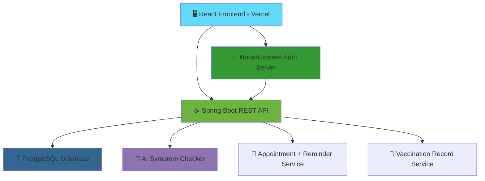

```
 ____                       _     ____      _      ____
/ ___| _ __ ___   __ _ _ __| |_  |  _ \ ___| |_   / ___|__ _ _ __ ___
\___ \| '_ ` _ \ / _` | '__| __| | |_) / _ \ __| | |   / _` | '__/ _ \
 ___) | | | | | | (_| | |  | |_  |  __/  __/ |_  | |__| (_| | | |  __/
|____/|_| |_| |_|\__,_|_|   \__| |_|   \___|\__|  \____\__,_|_|  \___|
```

## Smart Pet Care Platform

**AI-Assisted · Full-Stack · Vet-Friendly**

[](https://react.dev)
[](https://spring.io/projects/spring-boot)
[](https://nodejs.org)
[](https://www.postgresql.org)
[](https://ai.google.dev)
[](https://smart-petcare-web.vercel.app)
[](#-license)

> **Smart Pet Care Platform** is a full-stack web app that connects pet owners and veterinarians — combining an **AI symptom checker**, **appointment booking with reminders**, **role-based owner/vet portals**, and a **vaccination & medical record tracker** into one clean dashboard.

[📖 Documentation](docs/) · [🚀 Quick Start](#-quick-start) · [🎯 Features](#-key-features) · [🏗️ Architecture](#%EF%B8%8F-system-architecture) · [👤 Developer](#-meet-the-developer)

🔗 **Live Demo:** [smart-petcare-web.vercel.app](https://smart-petcare-web.vercel.app)

---

## 📑 Table of Contents

| Core Sections | Technical Deep Dives | Resources |
|---|---|---|
| [🎯 Key Features](#-key-features) | [🏗️ System Architecture](#%EF%B8%8F-system-architecture) | [📁 Project Structure](#-project-structure) |
| [🆚 Why This Platform?](#-why-this-platform) | [💬 AI Triage Pipeline](#-ai-symptom-triage-pipeline) | [🚀 Quick Start](#-quick-start) |
| [🎯 Key Differentiators](#-key-differentiators) | [📅 Request Walkthrough](#-request-walkthrough) | [🗺️ Roadmap](#%EF%B8%8F-roadmap) |
| [🗄️ Database Schema](#%EF%B8%8F-database-schema) | [🔐 Auth & Tunneling](#-auth--tunneling) | [👤 Meet the Developer](#-meet-the-developer) |

---

## 🎯 Key Features

| Feature | Description |
|---|---|
| 🐾 **Pet Profiles** | Centralized records for each pet — breed, age, medical notes |
| 💬 **AI Symptom Checker** | Chat-based triage that reads symptoms and flags likely concerns before a vet visit |
| 📅 **Appointment Booking & Reminders** | Owners book vet slots; automated reminders reduce missed visits |
| 👩‍⚕️ **Vet & Owner Portals** | Role-based dashboards — vets manage patients, owners manage their pets |
| 💉 **Vaccination & Medical Record Tracker** | Full vaccination history and medical event log, shared between owner and vet |
| 📊 **Vitals & Wellness Logs** | Weight, activity, and feeding trends tracked over time |
| 🔐 **Authenticated Access** | Dedicated auth server issues and validates sessions for both roles |
| 🌐 **Live Deployment** | Publicly accessible at [smart-petcare-web.vercel.app](https://smart-petcare-web.vercel.app) |

---

## 🆚 Why This Platform?

| Capability | Typical Pet App | **Smart Pet Care Platform** |
|---|---|---|
| Symptom Guidance | None | 💬 AI-assisted symptom checker |
| Vet Communication | Phone / walk-in only | 📅 Integrated booking + automated reminders |
| Medical History | Scattered paper records | 💉 Centralized vaccination/medical tracker |
| Access Model | Single-user | 👩‍⚕️ Owner + Vet role-based portals |
| Data Ownership | Ad-hoc / spreadsheet | 🗄️ Relational PostgreSQL store |
| Auth | Basic / none | 🔐 Dedicated auth server with session validation |

### 🎯 Key Differentiators

| | | | |
|---|---|---|---|
|  |  |  |  |
| **AI Symptom Checker**<br>Reads free-text symptoms, not just dropdowns | **Owner ↔ Vet Bridge**<br>Shared record trail instead of scattered notes | **Role-Based Auth**<br>Owners and vets each see only what's theirs | **Deployed & Reachable**<br>Live on Vercel, not just localhost |

---

## 🏗️ System Architecture



*The React frontend (Vercel) talks to a Node/Express auth layer for login/session handling, and to the Spring Boot API for pets, appointments, records, and AI features — all backed by PostgreSQL.*

---

## 💬 AI Symptom Triage Pipeline

```
┌─────────────────────────────────────────────────────────────────┐
│                    🐾 OWNER MESSAGE                              │
│         "My dog has been limping since yesterday"                │
└────────────────────────────┬─────────────────────────────────────┘
                             │
          ╔══════════════════▼═══════════════════════════════════╗
          ║      🔐  LAYER 1 · AUTH & SESSION CHECK               ║
          ║            Node/Express Auth Server                  ║
          ║                                                      ║
          ║  ✓ Valid session token ················· required   ║
          ║  ✓ Owner ↔ pet ownership check ·········· verified   ║
          ╚═══════════════╤═══════════════════════════════════════╝
                          │
          ╔═══════════════▼═══════════════════════════════════════╗
          ║      💬  LAYER 2 · AI SYMPTOM CHECKER                 ║
          ║           Gemini-powered triage engine                ║
          ║                                                      ║
          ║  "limping" ──────────────► Possible injury/joint issue║
          ║  "since yesterday" ──────► Duration flag: 1 day       ║
          ║  Species + breed context ─► Weighted against profile  ║
          ║                                                      ║
          ║  📊 Urgency Estimate: MODERATE                        ║
          ╚═══════════════╤═══════════════════════════════════════╝
                          │
          ╔═══════════════▼═══════════════════════════════════════╗
          ║      📅  LAYER 3 · APPOINTMENT DECISION                ║
          ║          Spring Boot Decision Service                 ║
          ║                                                      ║
          ║  ✅ Suggest earliest vet slot                          ║
          ║  💡 Reasoning: Moderate urgency, no red-flag symptoms  ║
          ║  📖 Logged to medical record for vet review            ║
          ╚═════════════════════════════════════════════════════╝
```

---

## 📅 Request Walkthrough

```
Owner  →  "My dog has been limping since yesterday"
 Bot   →  💬 Got it — a few quick questions to understand better.
          Is your dog putting any weight on the leg at all?

Owner  →  "A little, but he yelps sometimes"
 Bot   →  📊 Urgency: MODERATE — this looks like it should be checked soon,
          not necessarily an emergency.

 Bot   →  📅 Available vet slots:
          • Tomorrow, 10:00 AM — Dr. Meena
          • Tomorrow, 2:30 PM  — Dr. Arjun

Owner  →  Books 10:00 AM slot
 Bot   →  ✅ Appointment confirmed. Reminder set for 1 hour before.
          Symptom summary saved to your pet's medical record for the vet.
```

---

## 🗄️ Database Schema

The schema and seed data live in [`database/schema.sql`](database/schema.sql). Core entities include pet profiles, owners, veterinarians, appointments, vaccination/medical records, and wellness logs.

**To initialize locally:**
```sql
-- inside pgAdmin or the psql console
\i database/schema.sql
```

---

## 🔐 Auth & Tunneling

| Component | Purpose |
|---|---|
| `auth-server.js` | Lightweight Node/Express server handling login and session validation |
| `auth-users.json` | Local/dev auth store — **do not** commit real credentials here |
| `cloudflared` | Tunnels the local backend so the Vercel-deployed frontend can reach it in dev |

> ⚠️ For production, move auth storage to a database-backed user table and rotate any tunnel URLs regularly.

---

## 📁 Project Structure

```
SMART-PETCARE-WEB/
│
├── database/
│   └── schema.sql            Pets · owners · vets · appointments · records
│
├── backend/                  Spring Boot REST API
│   └── src/main/java/...     Controllers · Services · Repositories · Entities
│
├── frontend/                 React web application
│   └── src/                  Components · Pages · Services · Hooks
│
├── docs/                     Project documentation
│
├── auth-server.js            Node/Express auth server (login/session)
├── auth-users.json           Local auth store (dev only)
├── cloudflared.exe           Cloudflare Tunnel binary (dev use)
├── package.json / package-lock.json
└── .vscode/                  Editor settings
```

---

## 🚀 Quick Start

**1 · Clone the repository**
```bash
git clone https://github.com/HareshK-14/SMART-PETCARE-WEB.git
cd SMART-PETCARE-WEB
```

**2 · Set up the database**
```bash
\i database/schema.sql
```

**3 · Run the Spring Boot backend**
```bash
cd backend
./mvnw spring-boot:run
```

**4 · Run the auth server**
```bash
node auth-server.js
```

**5 · Run the frontend**
```bash
cd frontend
npm install
npm run dev
```

**6 · (Optional) Tunnel your local backend for the deployed frontend**
```bash
cloudflared tunnel --url http://localhost:8080
```

---

## 🗺️ Roadmap

| Stage | Status | Description |
|---|---|---|
| 1 | ✅ Done | PostgreSQL schema and seed data |
| 2 | ✅ Done | Spring Boot REST API + Node/Express auth server |
| 3 | ✅ Done | React frontend deployed on Vercel |
| 4 | 🔄 In Progress | AI symptom checker + wellness insights |
| 5 | 🔲 Planned | Appointment reminders (email/SMS) |
| 6 | 🔲 Planned | Vaccination/medical record dashboard polish |
| 7 | 🔲 Planned | Docker Compose for one-command local setup |

---

## 👤 Meet the Developer

[](https://github.com/HareshK-14)

**Haresh K.** — Full-Stack Developer
B.Tech Information Technology, V.S.B. Engineering College

[](https://github.com/HareshK-14)
[](https://smart-petcare-web.vercel.app)

---

## 🛠️ Built With

[](https://react.dev)
[](https://spring.io)
[](https://nodejs.org)
[](https://www.postgresql.org)
[](https://ai.google.dev)

### ⭐ Star this repo if you find it useful!

Made with 🐾 for pet owners and their vets.
